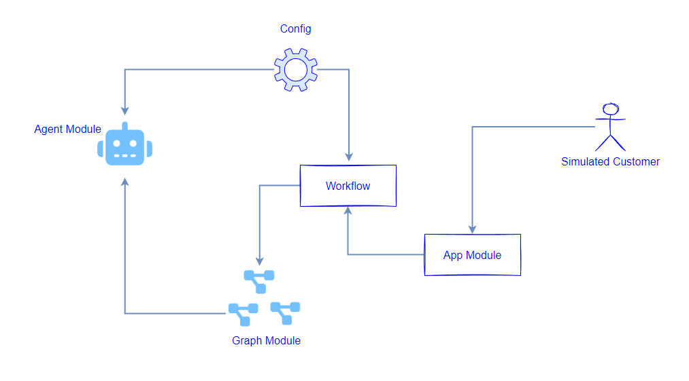

# How_I_Built_Refund_Processing_Using_AI_Agents
How I Built Refund Processing Using AI Agents

## Introduction

Full Article : https://medium.com/@learn-simplified/how-i-built-a-simple-semantic-search-engine-all-ai-all-local-68c4db4f6986

I'm excited to share with you how I built a comprehensive refund processing system using artificial intelligence (AI) agents. This article will take you on a journey of how AI Agents tackled the task of refund handling, from the initial planning to the final implementation.
While I chose one of real world use case, same approach, design can be used to any real world application.

## What's This Project About?

In this article, I'll walk you through the process of creating a refund processing system that leverages AI Agents to streamline the customer experience. I'll cover the key components, such as setting up a conversational workflow, integrating language models, and designing a simulated user interaction. The goal is to showcase how AI can be applied to enhance traditional business processes, in this case, the often tedious task of managing customer refunds.

## Why Use This Project?

The ability to provide efficient and personalized customer service is crucial. AI-driven solutions are transforming the way companies interact with their customers, and this article will demonstrate how you can harness the power of AI to revolutionize your refund processing system.
By reading this article, you'll gain insights into the practical implementation of AI agents and understand how they can be used to improve customer satisfaction, reduce operational costs, and enhance the overall efficiency of your refund management processes. This article is particularly relevant for businesses that deal with a high volume of refund requests and are looking to optimize their customer experience.

## Architecture



# Tutorial: Setting Up and Running AI Agent Powered Refund Processing System

## Prerequisites
- Python installed on your system.
- A basic understanding of virtual environments and command-line tools.

## Steps

1. **Virtual Environment Setup:**
   - Create a dedicated virtual environment for our project:
   
     ```bash
     python -m venv How_I_Built_Refund_Processing_Using_AI_Agents
     ```
   - Activate the environment:
   
     - Windows:
       ```bash
       How_I_Built_Refund_Processing_Using_AI_Agents\Scripts\activate
       ```
     - Unix/macOS:
       ```bash
       source How_I_Built_Refund_Processing_Using_AI_Agents/bin/activate
       ```

2. **Install Project Dependencies:**

   - Navigate to your project directory and install required packages using `pip`:
   
     ```bash
        
     cd path/to/your/project
     pip install -r requirements.txt
     ```

3. **Run - AI Agent Powered Refund Processing System**

   Finally, execute the following command to start the "AI Agent Powered Refund Processing System" application:

   ```bash 
   # generate synthetic cases of our Law Firm
   python app.py
    ```
   


